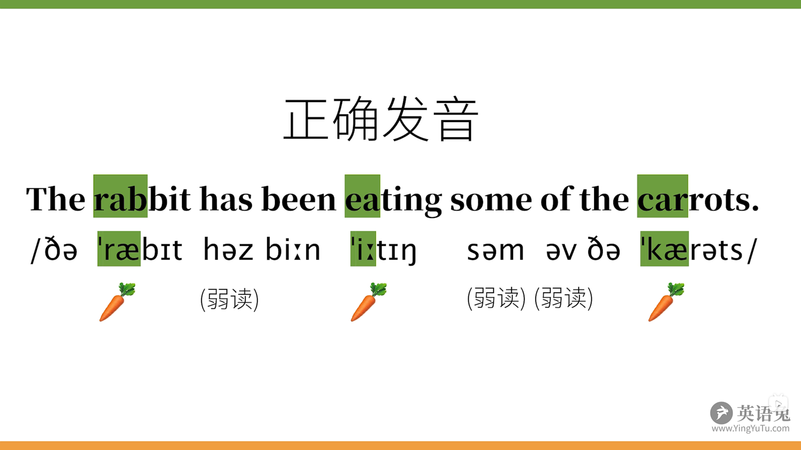

# 英语发音技巧

参考：[你必须知道的英语语音技巧(让你的口语更纯正, 更地道!)](https://www.bilibili.com/video/BV1SZ4y1K7Lr?p=1)

> [英语与中文的发音差别](https://www.bilibili.com/video/BV1rt4y197Dy)

+ 英语：重音等时性语言
+ 中文：音节等时性语言
+ 英语要知道哪些词一般会弱读，哪些需要重读；而中文只要每个音节都读的字正腔圆就可以了

## 1.连音

### 1.1辅音结尾 + 元音开头

> 当上一个单词以辅音结尾而下一个单词以元音开头时，词尾的音和开头的音会连在一起，这就是连音

+ not at all的音标是【/nɒt ət ɔːl/】，里面连读起来就是【/nɒ<u>tə</u>tɔːl/】（下划线分割拼读）
+ all of it的音标是【/ɔːl əv ɪt/】，说话时的读出来是【/ɔː<u>lə</u>vɪt/】，里面的【lə】是连读，读成 哦乐vi特
+ in an instant的音标是【/ɪn ən 'ɪnstənt/】，说话时的读出来是【/ɪ<u>nə</u>n'ɪnstənt/】,里面的【nə】是连读，读成 伊呢 呢音寺特嗯特

## 2.加音

### **2.1元音结尾 + 元音开头**

> 元音和元音在一起容易糊，不好读，加上一个之前不存在的过渡音，使得发音连贯。
>不是先有加音规则，再照做，而是先有发音发到位，自然而然产生的过渡音，所以后人才总结出来加音规律

+ a 👉 an；

  + an apple 安那剖

+ 加音

  + **/w/：**/uː/，/ʊ/，/aʊ/，/əʊ/ + 元音

    之所以加/w/，是因为/w/半元音和这个/u:/，/ʊ/口型相似，又有一定的辅音特性，发音时自然而然的口型就会生成/w/的音
    just do it		       👉 		just do + /w/ + it
    who is 			      👉 		who + /w/ + is
    too often 		     👉 		too + /w/ + often

  + **/j/：**/iː/，/ɪ/，/eɪ/，/aɪ/，/ɔɪ/ + 元音

    如果前一个单词的结尾元音是单元音/iː/ 或者/ɪ/，又或者带有这个音特性的双元音/eɪ/，/aɪ/，/ɔɪ/ 时，习惯加上一个/j/过渡，因为/j/这个半元音和/i:/，/ɪ/口型相似，又有一定的辅音特性，便于在两个元音之间发音
    I am                       👉        I + /j/ + am
    she asked             👉        she + /j/ + asked

  + **/r/：**/ə/，/ɑː/，/ɔː/ + 元音（英式）

    因为/r/这个音的舌位和以上几个元音相似，便于在两个元音发音(英式)
    the idea of            👉         the idea + /r/ + of
    law and order      👉         law + /r/ + and order
    China and lndia   👉         China + /r/ + and lndia

    还有一种情况：r结尾 + 元音开头，往往会连起来
    bear it                    👉         bearit
    gear up                  👉         gearup
    far away                 👉         faraway
    
    单词结尾的r本来是不发音的(英式)，只有在下个单词是元音开头的时候，才会发音为r，bear：bei
    单词结尾的r往往都会使之前的元音r化(美式)，bear：bei er

## 3.同化

> 现有”同化“现象，再总结出规律

### 3.1.逆行同化

> 前面音收到后面音影响

#### 3.3.1.无声除阻

> 前面的塞音(爆破音)碰到后面的辅音时，前面这个音变弱了许多，而不完全发音发出来，叫无声除阻，不完全爆破，失去爆破，失爆

+ /k/ + 辅音
  + look back
+ /t/ + 辅音
  + that job
+ /d/ + 辅音
  + good night

#### 3.3.2.浊音 vs. 清音

> 浊音 + 清音，声带振动突然停止，不好发音，干脆声带不振动，第一个变成清音

+ have to：/hæ~~v~~ → hæf/
+ of course：/ə~~v~~ → əf/

#### 3.3.3.鼻音

>非闭嘴唇的音 + 闭嘴唇的音，突然转换，不好发音，会将第一个变成闭嘴唇的音

+ in person：/ɪ~~n~~ → ɪm/
+ impolite，本来作为否定的前缀in，甚至拼写都发生了变化，im

### 3.2.顺行同化

> 后面音收到前面音影响

#### 3.2.1.复数词尾s

>声带不震动的清音，如果后面s突然震动声带，会太累了，干脆发音为/s/；

+ books：/bʊ~~kz~~  bʊks/

> 声带震动的浊音，如果后面s突然不震动声带，会太累了，干脆发音为/z/；

+ dogs：/dɒ~~gs~~  dɒgz/

### 3.3.前后音互相作用

> 两个音互相作用

#### 3.3.1.融合

> 后一个音是半元音/j/

+ /s/ + /j/ = /ʃ/
  + God bless you.
+ /z/ + /j/ = /ʒ/
  + as you wish
+ /t/ + /j/ = /tʃ/
  + Nice to meet you
+ /d/ + /j/ = /dʒ/
  + Did you do it?

>单词内容也会发生

+ educate：/ˈedʒukeɪt/
+ mutual：/ˈmjuːtʃuəl/
+ tissue：/ˈtɪʃuː/

#### 3.3.2.辅音延长

> 前后两个音是同一个音，发音只需发一次(发后面的音)，叫辅音延长

+ life force
+ fish shop
+ black coffee

## 4.异化

> 现有”异化“现象，再总结出规律

### 4.1."s"

> /s/送气音如果再接一个送气/t/，/k/，/p/，根本不好发音，这里只是变为不送气版本而已，声带并不振动，严格来说，他们并不是/d/，/g/，/b/的音，不等同于~~浊化~~

+ /s/ + /t → d/
+ /s/ + /k → g/
+ /s/ + /p → b/

### 4.2."r"

> 在美式英语中往往会让之前的元音”r化“，但出现两个r化时，会让前面"r化"消失，否则有点拗口

+ su**r**prise
+ pa**r**ticular
+ gove**r**nor

## 5.省音

### 5.1.单词内省音

+ 通常省音：diff**e**rent
+ 可选择：sim**i**lar
+ 必须省音：debt, know, write

### 5.2.单词间省音

+ t的省音: las**t** year
+ d的省音: you an**d** me
+ h-dropping: tell **h**er I love her
+ g-dropping: how ya doin**'**? 

> 示例

+ nex**t** door
+ mos**t** common
+ mus**t** be 
+ you an**d** me 
+ gi**ve** me that 
+ What's **h**is name?

## 6.缩读

> 用于口语中，不能用于书面语和演讲

+ want to = wanna
+ going to = gonna
+ have got to = gotta 
+ out of = outta
+ kind of = kinda
+ a lot of = a lotta
+ don't know = dunno
+ give me = gimme
+ would have = would've / would'a
+ you and I = you 'n' I
+ come on = c'mon
+ what are you = wachya / watcha
+ what do you = whaddya / wadya
+ what did you = whatdja / wadja

## 7.弱读

> 让饱满的元音发音变成一个弱一点的音，而这个弱一点的音，通常是中央元音，/ə/，因为这样在两个其他重读音节之中，这样的虚词可以很轻松很快读出来。

What **do** you want **to** **do**? 
**From** **what** I **can** tell, you **must** be tired **of** it, **but** I'm not, 
so **would** you like me **to** **do** it **for** you?

do, to, from, what, can, must, of, but, would, for
/də  tə  frəm  wtə  kən  məst  əv  bət  wəd  fə/

> 一般来说，弱读的是：少音节的虚词，如介词，冠词，代词，连词，助动词，一般不影响句子意思的关键词

+ 介词
  + at
  + for
  + from
  + of
  + to
+ 冠词
  + an
  + some
+ 连词
  + and 
  + but
+ 代词
  + you
  + us
  + them
  + her
+ 助动词
  + am
  + are
  + have
  + has
  + do 
  + does
  + would
  + can
  + could
  + should

> 什么时候不弱读？

+ 句末：
  + May I do it for **you**?
+ 对比：
  + government **of** the people, **by** the people, **for** the people.
+ 强调：
  + I'm not **A** rabbit! I'm **THE** rabbit.

## 8.节奏

> 单词中有重度音节和非重读音节，**重读音节之间的时长基本相等**，

> 英文句中词语所花时间**并非**由**音节数量**的总数决定，而是由重读音节数量决定

## 9.语调

### 9.1.语音

### 9.2.节奏

### 9.3.断句 & 停顿

### 9.4.强度 & 响度