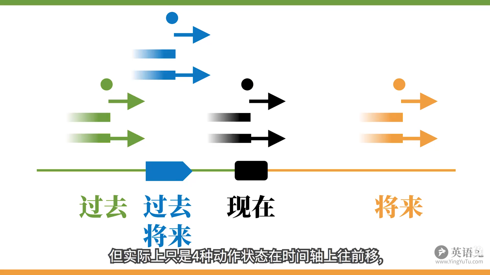
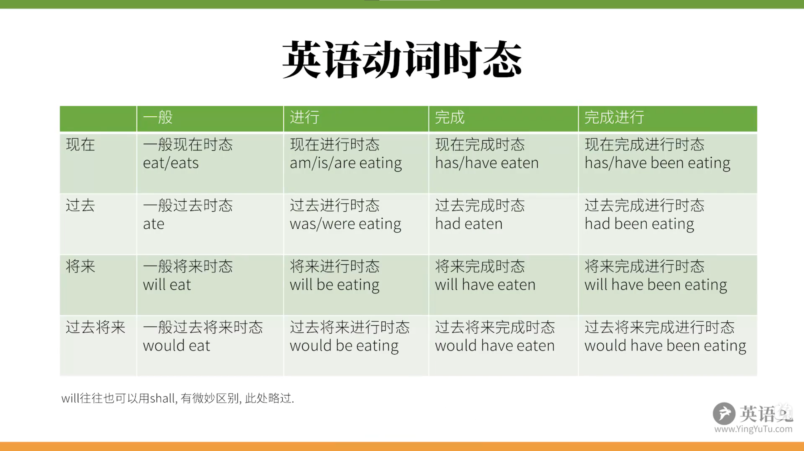

### [语法体系(重要)](https://www.bilibili.com/video/BV1r54y1m7gd)

#### 简单句

> 所有句子拆到不能再拆都是：什么怎么样，又称主语+谓语

> #### 五种基本句型
>
> 1. 可以独立完成的动作						主语+**不及物动词**									  He **sleeps**.
> 2. 有一个动作的承受者                        主语+**及物动词**+宾语 							   He **likes** you.
> 3. 有两个动作承受者						    主语+**双及物动词**+间接宾语+直接宾语   He **teaches** you English.
> 4. 只有一个动作承受者(不同于2)        主语+**复杂及物动词**+宾语+(宾语)补语     He **considers** you smart.
> 5. 把这个词后面的信息赋予给前者     主语+**系动词**+(主语)补语(表语)                He **is** tall. He **looks** tall.

> #### 句子成分
>
> 1. 主语
> 2. 谓语动词(~谓语)
> 3. 宾语
> 4. 宾语补语：补充宾语信息  He considers you **smart**.
> 5. 主语补语：补充主语信息  He is tall. He looks **tall**.
> 6. 定语：修饰主语和宾语   **The little white** rabbit ate **a large** carrot.
> 7. 状语：修饰谓语动词的词 The rabbit ate **quickly**.
> 8. 同位语：再把主语说一遍 Papa Rabbit, **an English teacher**, eat a carrot.

> #### 词类
>
> 1. 名词
> 2. 冠词
> 3. 代词
> 4. 形容词
> 5. 数词
> 6. 副词
> 7. 介词
> 8. 叹词
> 9. 连词
> 10. 动词

> #### 句子成分vs词类
>
> 

> #### 谓语动词三大本领
>
> 1. 表示动作的时间：现在，过去，将来，从过去某个时间点"算将来"(过去将来)
>
> 2. 表示动作的状态：未说明(一般)，完成，进行，不但完成而且继续(完成进行)
>
>    时间和状态成为时态，自由排列组合有16中时态
>
> 3. 表示动作的假设，情感等： If I were a rabbit. 虚拟语气，这里用were而不是was暗示 并自己并不是兔子
>
> 合称：TAM：时(Tense) 体(Aspect) 气(Mood) 
>
> 英语的谓语动词本身往往是不能独立完成刚才所说的那些本领，需要助动词来帮助，例如：吃 Eat
>
> 1. 为了协助它表示吃过了(完成态),就要用到助动词, have,  have eaten.
> 2. 为了协助它表示正在吃(进行态),就要用到助动词, be,  is eating.
> 3. 为了协助它表示是"被"吃,就要用到助动词be, is eaten.
> 4. 为了协助它表示有能力吃,就要用到助动词can,  can eat.
> 5. 为了协助它表示有可能吃,就要用到助动词might,  might eat.
> 6. 为了协助它表示有义务吃,就要用的助动词must,  must eat.
> 7. 为了协助它表示否定,不吃,就需要用到助动词do, do not eat.
>
> 不要把助动词和其他身份(实义动词)弄混淆

> #### 非谓语动词
>
> 1. 动词不定式 to eat  
> 2. 现在分词 eating
> 3. 动名词 eating
> 4. 过去分词 eaten
>
> 并不能确定是动词不定式还是动词原形

> #### 谓语动词vs非谓语动词
>
> 谓语动词进行修改可以改为非谓语动词，非谓语动词几乎可以取代所有的从句，从而简化句子
>
> 只不过这样的动词就不再具有表示动作时间，状态，语态，语气的功能

#### 并列复合句(复合句)

> 并列关系的复合句

#### 主从复合句(复杂句)

> 从属关系的复杂巨，包括主句和从句，从句可以充当所有句子的成分

#### 英语语法体系

> [不规则动词的规律](www.YingYuTu.com/bgz)

### 

### 16种时态

> 动词时间+动词的状态，合称时态

> 时间轴表示

> 缩略图

#### 一般现在时

> 动词原形
>
> 动词原形 + s(第三人称单数)
>
> 
>
> #### 1.表示事实
>
> I **eat** carrots.
>
> The rabbit **eats** carrots.
>
> The sun **rises** in the east. 太阳从东边升起
>
> The earth **revolves** around the sun. 地球绕太阳转
>
> 
>
> #### 2.表达习惯/重复的动作
>
> I **play** basketball. 我打篮球(我有这个习惯)
>
> 
>
> #### 3.表示预计发生的事
>
> The bus **leaves** at 8PM tonight.

#### 现在进行时

> 助动词be的变位 + 动词的现在分词
>
> #### be
>
> 1. (连)系动词
>
> I **am** s smart rabbit.
>
> 2. 助动词，构成时态
>
> I **am**
>
> You/we/they **are**
>
> She/he/it **is**
>
> #### 现在分词
>
> 通常：+ing
>
> you写动词在此基础上改变拼写（方便发音或避免误解），如：
>
> 1. write 👉 writing，不是~~writeing~~
> 2. hit 👉 hitting，不是~~hiting~~
> 3. die 👉 dying，不是~~dieing~~
>
> 其实英语很多不规则，其实都有他不按规则的道理
>
> 
>
> I **am eating** carrots. 我正在吃(一些)胡萝卜
>
> I **am eating** a carrot. 我正在吃一根胡萝卜

#### 现在完成时

> 对于现在而言，某个动作是否已经完成了，往往考虑过去的动作对现在的影响
>
> 助动词have的变位 + 动词的过去分词
>
> #### have
>
> 1. 实义动词
>
> I **have** some coins for this video. 我有一些硬币给这个视频
>
> 2. 助动词，构成时态
>
> I/you/we/they **have**
>
> She/he/it **has**
>
> #### 过去分词
>
> 通常：+ed，过去分词 ≠ 过去式
>
> 有些动词事不规则变化，如：
>
> eat 👉 eaten;  give, see, fall 👉  giv**en**, se**en**, fall**en**
>
> bring 👉 brought; bring,buy, fight, think 👉 br**ought**, b**ought**, **fought**, t**hought**
>
> fell 👉 felt;  fell, keep, sleep, leave 👉 fe**lt**, ke**pt**, sle**pt**, le**ft**
>
> 
>
> I **have eaten** carrots. 我吃过胡萝卜(言下之意：我曾吃过这种食物，是只见过世面的兔子)
>
> I **have eaten** a carrot. 我吃过了一跟胡萝卜(言下之意：我已经吃了，所以不饿)
>
> You/we/they **have eaten** a carrot.
>
> She/he/it **has eaten** a carrot.
>
> The rabbit **has eaten** a carrot. 这兔子到现在为止已经吃了个胡萝卜
>
> You **have watched** my video. 你到现在为止已经看过了我的视频

#### 现在完成进行时

> 就是将现在进行时和现在完成时进行融合
>
> + 现在进行时：**be** + 动词的现在分词
>+ 现在完成时：**have/has** + 动词的过去分词
> 
>have的变位(**have/has**) + been(**be的过去分词,都是been**) + 动词的现在分词(甚至已经不用过去分词)
> 
>
> 
>I **have been eating** carrots. 我正在吃胡萝卜(不短已经吃了些，还将继续)
> 
>The rabbit **has been eating** a carrot. 这兔子到现在为止已经吃胡萝卜一段时间了，还要继续吃
> 
>You **have been watching** my video. 你到现在为止已经看了我时间一段时间，还要继续看
> 
>I **have been thinking** of you. 我到现在已经想你一段时间了，还要继续想

####  

#### 一般过去时

> 某个动作在过去有没有发生，往往考虑的是过去的事实
>
> +动词过去式，各个人称都是一样的
>
> eat(原形) 👉 ate(过去式)(**为什么要变因为时间变了，谓语动词包含时间的本领**)
>
> I/you/we/she/he/it/they **ate** a carrot yesterday.
>
> ate(过去式)  ≠  eaten(过去分词)
>
> 
>
> The rabbit **ate** a carrot. 兔子**吃了**胡萝卜(只知道这只兔子过去某个时刻吃胡萝卜)
>
> You **watched** my video. 你**看了**我的视频
>
> 动作发生了		√
>
> 动作多久			？
>
> 动作何时开始	？
>
> 动作何时结束	？
>
> 
>
> #### 过去式
>
> 通常：+ed
>
> 有些动词时不规则变化，如：
>
> | 动词原形 | 动词过去式 | 动词过去分词 |
> | -------- | ---------- | ------------ |
> | do       | did        | done         |
> | go       | went       | gone         |
> | take     | took       | taken        |
>
> 
>
> 不规则过去式的规律
>
> | 动词原形 | 动词过去式  | 动词过去分词   |
> | -------- | ----------- | -------------- |
> | bring    | br**ought** | br**ought**    |
> | buy      | b**ought**  | b**ought**     |
> | fight    | f**ought**  | f**ought**     |
> |          |             |                |
> | blow     | bl**e**w    | blow**n**      |
> | grow     | gr**e**w    | grow**n**      |
> | know     | kn**e**w    | know**n**      |
> |          |             |                |
> | begin    | beg**a**n   | beg**u**n      |
> | sing     | s**a**ng    | s**u**ng       |
> | swim     | sw**a**m    | sw**u**m       |
> |          |             |                |
> | speak    | sp**o**ke   | sp**o**k**en** |
> | freeze   | fr**o**ze   | fr**o**z**en** |
> | choose   | ch**o**se   | ch**o**s**en** |

#### 过去进行时

> + **现在**进行时：助动词be的变位(**am/is/are**) +  动词的现在分词
>+ **过去**进行时：助动词be的变位(**was/were**) + 动词的现在分词
> 
>The rabbit **is eating** a carrot. 👉 The rabbit **was eating** a carrot. 
> 这兔子**在过去**某个时间点处**正在**吃胡萝卜的过程中
> 
>You **are watching** my video. 👉 You **were watching** my video.
> 你**在过去**某个时间点处**正在**看我的视频的过程中
> 
>I **am thinking** of you. 👉 I **was thinking** of you. 
> 我**在过去**某个时间点处**正在**想你

#### 过去完成时

>+ **现在**完成时：主要表达对现在的影响，助动词have的变位(**have/has**) + 动词的过去分词
>+ **过去**完成时：主要表达过去(B)对过去(A)的影响（顺序：B A 现在）助动词have的变位(**had**) + 动词的过去分词
>
>
>
>I **had eaten** 5 carrots for lunch yesterday, so I wasn't hungry at all yesterday afternoon.
>这里要表达的意思就是，因为昨天下午的过去(**时间点B**，也就是昨天午饭时间)，我已经吃了一些胡萝卜，对于**昨天下午(时间点A**)来说，所以B对A有影响，影响就是：我一点都不饿
>
>
>
>He tried to find me yesterday afternoon, but **I had already gone** to Shanghai.
>对于他试图找我那个**时间点A(昨天下午)**来说，A的过去**某一点B**(可能时昨天上午，或前天，没说明，但是肯定时昨天下午之前)我已经离开了，去上海了，所以B对A有影响，影响就是：他找不到我
>
>
>
>The rabbit **has eaten** a carrot. 👉 The rabbit **had eaten** a carrot. 
>这兔子在**过去某个时间点**已经吃了跟胡萝卜
>
>You have watched my video. 👉 You **had watched** my video.
>你在**过去某个时间点**已经看过了我的视频
>
>I **have thought** of you. 👉 I **had thought** of you.
>我在**过去某个时间点**已经想过你了

#### 过去完成进行时

> 对于过去某个点已经完成了，而且还要继续进行的动作
>
> + **现在**完成进行时：助动词have的变位(**have/has**) + been + 动词的现在分词
>+ **过去**完成进行时：助动词have的变位(**had**) + been + 动词的现在分词
> 
>The rabbit **has been eating** a carrot. 👉 The rabbit **had been eating** a carrot.
> 这只兔子在**过去某个时间点**已经吃胡萝卜一段时间了，还要在那个时间点之后**继续**吃一段时间
> 
>You **have been watching** my video. 👉 You **had been watching** my video.
> 你在**过去某个时间点**已经看我视频一段时间了，还要在那个时间点之后**继续**看一段时间
> 
>I **have been thinking** of you. 👉 I **had been thinking** of you.
> 我在**过去某个时间点**已经想你一段时间了，还要在那个时间点之后**继续**想一段时间

#### 

#### 一般将来时

> 描述：将来某个时间点发生的动作(**说话者十分确定**会发生的事)，如果不太确定，就不能用一般将来时(需要借助动词的**语气**)
>
> #### 英语表达将来时态
>
> 一般现在时态可以表达将来的动作，如：The bus leaves at 8 PM.
>
> **助动词be的变位 + going + to + 动词原形**，如：I **am going to eat** a carrot.
>
> 甚至上句的going也可以省略，便为**助动词be的变位 + to + 动词原形**，如：You **are to eat** a carrot.
>
> 又或者也可以用借about取代going，即： **+ about + to + 动词原形**，如：I **am about to eat** a carrot.
>
> 最简单的就是**will + 助动词**，即：I/you/she/he/it/they **will eat** a carrot.
>
> The sun will rise again tomorrow.
> 太阳明天也会照常升起
>
> I will definitely do my bast to make high-quality videos.
> 我以后也一定会用尽全力做高质量视频

#### 将来进行时

> 描述：在将来某个时间，某个动作是在进行的过程中(比一般将来时还要笃定)
>
> + **现在**进行时：助动词be的变位(**am/is/are**) + 动词的现在分词
> + **将来**进行时：**will** + **be**(will已经算是变位过的助动词) + 动词的现在分词
>
> I **will be eating** a carrot tomorrow from 1 PM to 3 PM.
> 我明天1到3点会正在吃胡萝卜

#### 将来完成时态

> 现在完成时表达对现在的影响；将来完成时表达对将来的影响(比将来进行时更加笃定)
>
> 我明天4点前就会吃完胡萝卜，对于将来的时间点(明天4点)来说，我在那之前就会完成吃胡萝卜的动作，所以对4点钟是由影响的，影响就是：4点钟之后我就可以发视频了
>
> + **现在**完成时：助动词have的变位(**have,has**) + 动词的过去分词
> + **将来**完成时：**will** + **have**(前面的will已经算是变位过了) + 动词的过去分词
>
> I **will have eaten** the carrots by 4 PM tomorrow. 
>
> The rabbit **has eaten** a carrot. 👉 The rabbit **will have eaten** a carrot.
> 这兔子在将来某个时间点已经吃了个胡萝卜
>
> You **have watched** my video. 👉 You **will have watched** my video.
> 你在将来某个时间点已经看过了我的视频
>
> I **have thought** of you 👉 I will **have thought** of you.
> 我在将来某个时间点已经想过你了

#### 将来完成进行时

> 现在完成进行时表示现在已经完成，而且还会继续；将来完成进行时表示将来已经完成，而且还会继续
>
> + **现在**完成进行时：动词have的变位(**have,has**) + been + 动词的现在分词
> + **将来**完成进行时：**will** + **have** + been + 动词的现在分词
>
> I **will have been eating** carrots **for 2 hours** by **3 PM tomorrow**.
> 我确定**明天下午三点钟时**，我不但已经吃了**两个钟头**胡萝卜(也就是明天下午一点开始吃)而且还要继续吃
>
> You **have been watching** my video. 👉 You **will have been watching** my video
> 你在将来某个时间点之前已经看来我视频一段时间了，还要在那个时间之后继续看一段时间
>
> I **have been thinking** of you. 👉 I **will have been thinking** of you.
> 我在将来某个时间点已经想你一段时间了，还要在那个时间点后继续想你一段时间

#### 

#### 一般过去将来时

> 这里的过去时相对于过去的将来，和现在没有什么关系
>
> + **一般**将来时：**will** + 动词原形；助动词be的变位(**am/is/are**) + going + to
> + **过去**将来时：**would**(will的过去式) + 动词原形；助动词be的变位(**was/were**) + going to
>
> I **said** I **would eat** a carrot for lunch.
> 我(之前)说过我会午饭吃跟胡萝卜(午饭时间对于之前我说那句话的时间来说式在将来，但至于现在午饭时间有没有到，不得而知)
>
> I **knew** you **would watch** my video.
> 我(之前)就知道你会看完的视频(你看我视频这件事，对于我做出这个判断的时间来说式在将来)
>
> 
>
> I **said** I **would** eat a carrot for lunch. 👉 I said I **was going to** eat a carrot for lunch.
>
> I **knew** you **would** watch my video. 👉 I knew you **were going to** watch my video.
>
> 
>
> #### Would的多义
>
> I said I **would** eat carrot for lunch.
> 我之前说过我午饭会吃胡萝卜(**will的过去式变位，构成时态**)
>
> If I were you, I **would** eat a  carrot.
> 如果我是你，我会吃胡萝卜(构成动词eat的**虚拟语气**：我不可能是你，所以这里的吃是虚拟动作)
>
> **Would** you pass me the carrot, please?
> 能请你把胡萝卜递过来吗？(比Will you pass me the carrot?更礼貌)
>
> **Would** you like a carrot for lunch?
> 你是否午饭想吃胡萝卜？(比Do you want a carrot for lunch?更礼貌)

#### 过去将来进行时

> + **将来**进行时：will + be + 动词的现在分词
> + **过去将来**进行时：would + be + 动词的现在分词
>
> I **said** I **would be eating** a carrot at 1 PM tomorrow/yesterday.
> 我之前说我明天下午1点会在吃胡萝卜(我**之前说**我明天/昨天下午1点**会**是**在吃**胡萝卜这个过程中)

#### 过去将来完成时

> + **将来**完成时：**will**+ have + 动词的过去分词
> + **过去将来**完成时：**would** + have + 动词的过去分词
>
> I **said** I **would have eaten** a carrot by 1 PM tomorrow/yesterday.
> 我**(之前)说**我明天/昨天下午1点**会**已经**吃掉了**跟胡萝卜(我之前说我明天/昨天下午1点会已经做完了吃胡萝卜这个过程)

#### 过去将来完成进行时

> + **将来**完成时：**will** + have + been + 动词的现在分词
> + **过去**将来完成进行时：**would** + have + been + 动词的现在分词
>
> I **said** I **would have been eating** lunch for 2 hours by 1 PM tomorrow/yesterday.
> 我**(之前)说**我明天/昨天下午1点前会**已经吃了两种头午饭**(我**之前说**我**会**明天/昨天下午1点时在吃午饭这个过程中，**之前吃了两种头**，之后还会**继续吃**)

#### 

#### 常用时态

#### 现在完成时 vs 一般过去时

> + **现在**完成时：重点是某个动作是否**在说这句话之前已经完成了**，往往考虑过去的动作对现在的影响
> + **一般**过去时：重点是某个动作**在过去有没有发生**，往往考虑的是过去的事实
>
> ------
>
> I **have seen** a carrot.
>
> 我见过胡萝卜，表示见过世面
>
> 
>
> I **saw** a carrot.
>
> 我之前看到了一个胡萝卜，表示的事实
>
> ------
>
> I **have gone** to America.
>
> 我已经去美国了，多半暗示我已经离开
>
> 
>
> I **went** to America.
>
> 我去过美国，多半暗示我已经回来了
>
> ------

#### 一般过去时 vs 过去进行时

> + 一般过去时：重点是过去某个动作做了没有，过去的一张照片
> + 过去进行时：重点是某个动作在某个时间里在进行中的，过去的一段视频

> I **said** I **would have been eating** lunch for 2 hours by 1 PM tomorrow/yesterday.
> 我**(之前)说**我明天/昨天下午1点前会**已经吃了两种头午饭**(我**之前说**我会**明天/昨天下午1点时在吃午饭这个过程中，**之前吃了两种头，之后还会**继续吃**)